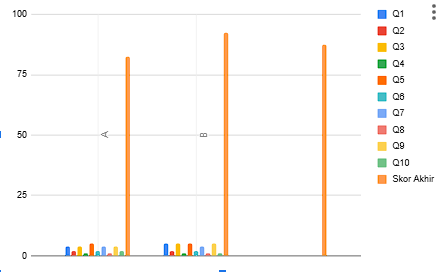

# Laporan Usability Study (SUS)

## Responden
- Jumlah: 2 responden (A dan B)

## Hasil Skor SUS
- Responden A: 82.5
- Responden B: 92.5
- **Rata-rata: 87.5**

## Interpretasi
Berdasarkan skala adjective SUS:
- Skor 87.5 termasuk dalam kategori **"Excellent"** (atau “Sangat Baik”).
- Artinya, aplikasi dinilai sangat usable oleh pengguna.

## Grafik Hasil

